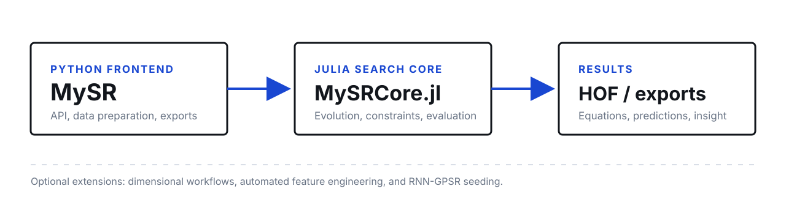

<div align="center">
  
  <p><strong>A Python interface for interpretable symbolic regression.</strong><br>
  Powered by a Julia search core for discovering compact, inspectable equations.</p>
  <p>
    <a href="https://github.com/TAO-MINGYU/MySR/releases"></a>
    <a href="https://github.com/TAO-MINGYU/MySR/blob/main/LICENSE"></a>
    <a href="https://github.com/TAO-MINGYU/MySR"></a>
  </p>
  <p>
    <a href="#quickstart">Quickstart</a>&nbsp;&middot;&nbsp;
    <a href="#capabilities">Capabilities</a>&nbsp;&middot;&nbsp;
    <a href="#architecture">Architecture</a>&nbsp;&middot;&nbsp;
    <a href="#development">Development</a>
  </p>
</div>

> MySR is an independent research software project derived from PySR. It is not an official PySR distribution.

## Overview

MySR is a general-purpose symbolic regression package for Python. It learns mathematical expressions from numerical data and returns equations that can be inspected, compared, and reused instead of treating the model as a black box.

The public interface follows the familiar scikit-learn workflow:

```python
model.fit(X, y)
predictions = model.predict(X)
```

The Python frontend is backed by [MySRCore.jl](https://github.com/TAO-MINGYU/MySRCore.jl), a Julia search core responsible for expression evolution, evaluation, constraints, constant optimization, and the Hall of Fame (HOF) / Pareto frontier.

## Why MySR?

- **Readable results**: search for equations that expose structure, not only predictive scores.
- **A familiar interface**: use a Python API that fits naturally into scientific and scikit-learn workflows.
- **Optional physical constraints**: use formula types and dimensional metadata when the problem requires them.
- **A research-ready foundation**: extend the search with automated feature engineering, user guesses, and optional RNN-GPSR seeding.

## Installation

Install the current released package directly from GitHub:

```bash
python -m pip install "git+https://github.com/TAO-MINGYU/MySR.git@v1.1.0"
```

Julia dependencies are resolved automatically through JuliaPkg on first import. The released configuration pins the compatible `MySRCore.jl` version, so users do not need to check out the Julia repository separately.

Verify the Python entry point:

```bash
python -c "from mysr import MySRRegressor; print(MySRRegressor)"
```

## Quickstart

The following example recovers a compact expression from synthetic data:

```python
import numpy as np

from mysr import MySRRegressor

rng = np.random.default_rng(7)
X = 2.0 * rng.normal(size=(200, 3))
y = 2.4 * np.cos(X[:, 2]) + X[:, 0] ** 2 - 0.5

model = MySRRegressor(
    niterations=40,
    binary_operators=["+", "-", "*"],
    unary_operators=["cos"],
)

model.fit(X, y, variable_names=["x0", "x1", "x2"])

print(model)
predictions = model.predict(X)
```

After fitting, `model.equations_` exposes the discovered equation frontier, while `predict`, `sympy`, `jax`, and `pytorch` provide practical ways to reuse the selected or indexed expressions.

## Capabilities

| Area | What MySR provides |
| --- | --- |
| Symbolic regression | Evolutionary search for compact expressions with an inspectable HOF / Pareto frontier. |
| Python workflow | A `MySRRegressor` interface designed around NumPy arrays and the scikit-learn style `fit` / `predict` pattern. |
| Formula types | `empirical`, `semi_theoretical`, and `theoretical` modes for progressively stronger dimensional contracts. |
| Dimensional analysis | Optional `X_dimensions` and `y_dimensions` metadata for hard backend checks in constrained workflows. |
| Automated feature engineering | An opt-in AI-Feynman-inspired surrogate branch and an opt-in FEAT-like feature-bundle branch. |
| Initialization | User `guesses` plus optional RNN-GPSR proposals before the formal MySRCore search. |
| Export | Callable, SymPy, NumPy, JAX, and PyTorch representations where supported by the configured expression. |

The extension layers are opt-in. With their defaults, existing preprocessing and search behavior is not changed by enabling MySR 1.1.0.

### Formula types and dimensions

Use `empirical` when the task is intentionally unconstrained by physical dimensions. For dimension-aware workflows, declare the formula type and pass dimension metadata during fitting:

```python
model = MySRRegressor(formula_type="theoretical", niterations=100)
model.fit(
    X,
    y,
    variable_names=["x1", "x2"],
    X_dimensions=[[1, 0, 0, 0, 0, 0, 0], [0, 1, 0, 0, 0, 0, 0]],
    y_dimensions=[1, 0, 0, 0, 0, 0, 0],
)
```

For `semi_theoretical` and `theoretical` modes, MySRCore performs the authoritative dimensional validation. The Python feature-engineering layer preserves candidate expressions, dimensions, and expanded complexity so that engineered variables do not become opaque free terminals.

### Automated feature engineering

When explicitly enabled, MySR can propose structured combinations such as differences, ratios, products, normalized differences, powers, and other controlled compositions. The `suggest` mode reports candidates; the `augment` mode adds validated candidates to the search input while retaining the original features.

```python
model = MySRRegressor(
    formula_type="empirical",
    auto_feature_engineering=True,
    feature_engineering_config={
        "mode": "suggest",
        "surrogate_engine": {"enabled": True},
    },
)
```

The current evidence for these extensions comes from focused synthetic tests. This README does not claim that MySR outperforms PySR.

### Optional RNN-GPSR seeding

RNN-GPSR is an optional initial-population proposal mechanism. It does not replace the formal MySRCore search, and every sampled expression is checked again by MySRCore before it can enter the search:

```bash
python -m pip install "mysr[rnn]"
```

## Architecture

<div align="center">
  
</div>

MySR keeps the user-facing orchestration in Python and the search authority in MySRCore.jl:

- **MySR** handles data preparation, configuration, feature proposals, prediction replay, and exports.
- **MySRCore.jl** handles expression generation, evolution, loss evaluation, dimensional legality, constant optimization, and HOF maintenance.
- **Results** are exposed as equations, predictions, and exportable representations for downstream analysis.

## Relationship to PySR

MySR is built from a fixed PySR 2.0.0-beta.3 source snapshot and continues to preserve upstream provenance in [NOTICE](https://github.com/TAO-MINGYU/MySR/blob/main/NOTICE), [VENDORING](https://github.com/TAO-MINGYU/MySR/blob/main/VENDORING.md), and [FORK_CHANGES](https://github.com/TAO-MINGYU/MySR/blob/main/FORK_CHANGES.md).

The project keeps the strengths of the PySR workflow while developing an independent package identity, backend boundary, dimensional contracts, feature-engineering extensions, and optional RNN-GPSR initialization.

For the upstream project and its algorithmic background, see [PySR](https://github.com/astroautomata/PySR) and the [PySR paper](https://arxiv.org/abs/2305.01582).

## Development

The development workspace contains two independently released repositories:

```text
/home/taomingyu/MySR_Dev/
|-- MySR/          # Python frontend
|-- MySRCore.jl/  # Julia search core
`-- Benchmark_mysr/
```

Clone the repository and install the Python package in editable mode:

```bash
git clone https://github.com/TAO-MINGYU/MySR.git
cd MySR
python -m pip install --editable .
```

The matched PySR/MySR benchmark suite lives in the independent [Benchmark_mysr](https://github.com/TAO-MINGYU/Benchmark_mysr) repository.

## Status

MySR 1.1.0 is research software under active development. The core package and released MySRCore backend are usable; new feature-engineering and RNN-GPSR paths remain opt-in and should be evaluated against the intended dataset and search budget before being used for scientific conclusions.

## License

MySR is released under the [Apache License 2.0](https://github.com/TAO-MINGYU/MySR/blob/main/LICENSE). It is an independent project and is not an official release of PySR or SymbolicRegression.jl.
